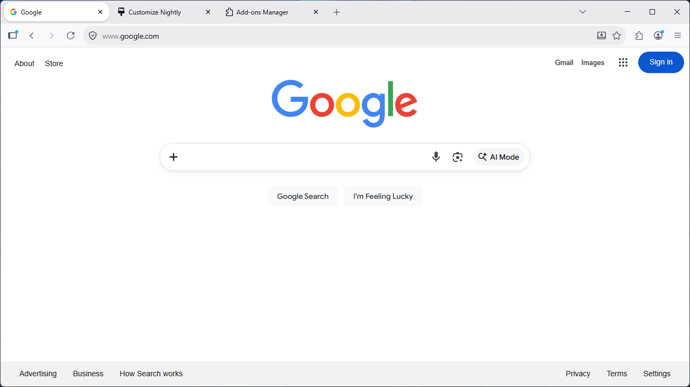
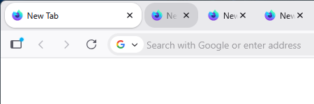
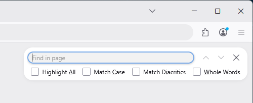

# Elegance

This style adds an elegant touch to the default Firefox design by creating a beautifully rounded user interface and by reworking a few core components of the browser.

### Collapsed tabs

Focused tabs will remain fully expanded for maximum readability, while the tabs around it collapse to make room for quicker navigation.

### Redesigned find bar

The find bar has been redesigned to take up less screen space, now appearing as a little popup overlay in the top-right corner of the browser window.

#### :info: Usage
1. Navigate to `about:config` and set the follow preferences:
	- `toolkit.legacyUserProfileCustomizations.stylesheets` = `true`
	- `svg.context-properties.content.enabled` = `true`
2. Navigate to `about:profiles` and open the root directory folder of the default profile.
3. Create a new folder and name it `chrome`.
4. Inside the `chrome` folder, extract the `userChrome.css` and `userContent.css` files as well as the `svg` folder.
5. Restart your browser.